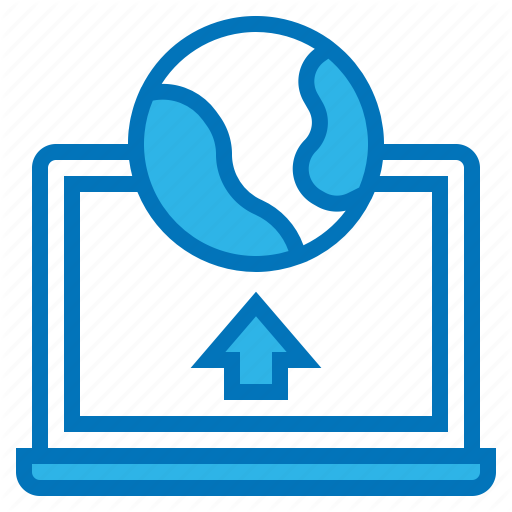

**WebLDM Publishing Manual for Developers**

**V1.1**

**© National Technology 2019, All Rights Reserved**

Table of Contents

[1. Purpose](#1-purpose)

[2. Audience](#2-audience)

[3. Definitions](#3-definitions)

[4. Git & Publishing Workflows](#4-git--publishing-workflows)

[4.1. Master, Develop & Baseline
Branches](#41-master-develop--baseline-branches)

[4.1.1. Master & Develop Cycle](#411-master--develop-cycle)

[4.1.2. WebLDM Publishing Types based on
Customers](#412-webldm-publishing-types-based-on-customers)

[4.3. General Publishing Workflow](#43-general-publishing-workflow)

[5. Publishing Pre-Requisites](#5-publishing-pre-requisites)

[6. Step by Step Publishing Procedures](#6-step-by-step-publishing-procedures)

[6.1. WebLDM Publishing Request on TFS (Role: Software
Testers)](#61-webldm-publishing-request-on-tfs-role-software-testers)

[6.2. Database Comparison (Role:
Developers)](#62-database-comparison-role-developers)

[6.2.1. Opening the Database Environment](#621-opening-the-database-environment)

[6.2.2. Comparing & Synchronizing the Databases
Automatically](#622-comparing--synchronizing-the-databases-automatically)

[6.3. Publishing WebLDM Application (Role:
Developers)](#63-publishing-webldm-application-role-developers)

[6.3.1. Publishing WebLDM to a Local
Folder](#631-publishing-webldm-to-a-local-folder)

[6.3.2. Uploading the Published Folder to the
Site](#632-uploading-the-published-folder-to-the-site)

[6.3.3. Confirming that WebLDM is
Operational](#633-confirming-that-webldm-is-operational)

[7. Appendices](#7-appendices)

[7.1. Appendix 1 – Git Branching Workflows](#_Toc25058642)

[7.1.1 Git Data Transport Commands](#711-git-data-transport-commands)

[7.1.2 Main GIT Branches](#712-main-git-branches)

[7.1.3. Feature Development in GIT](#713-feature-development-in-git)

[7.1.4. Release/Publish Management](#714-releasepublish-management)

[7.1.5. Baseline Hotfixes](#715-baseline-hotfixes)

# 1. Purpose

This manual helps you understand the foundations of WebLDM publishing, starting
with the basics of the of GIT branching, a definitions section, followed by a
step by step guide for publishing WebLDM database & application to the target
server including the resolution of common issues.

# 2. Audience

This document is intended for Software Developers.

# 3. Definitions

-   **Master:** This is the current stable version of WebLDM for all customers.

-   **Develop:** This is the current branch of the latest Master WebLDM version
    for the current iteration.

-   **Baseline:** This is a stable Master version of WebLDM that has specific
    customizations/CRs for a specific VIP customer - usually reserved for Hot
    Fixes/CRs - created due to the large number of the customer’s branches.

-   **Development Iteration:** A development iteration usually lasts for three
    months, and starts with the creation of a new branch from the **Master**
    called **Develop** on a separate server.

-   **Solution-based Publish:** Publishing the full WebLDM solution including
    the insertion of the database objects based on comparison – usually used for
    standard customers.

-   **Feature-based Publish:** Publishing only new features within specific
    locations/branches as opposed to publishing the whole solution – usually
    used for VIP large sized customers.

# 4. Git & Publishing Workflows

To understand clearly how the publishing process works locally or within
production, you need to know the following:

-   Master, Develop, & Baseline Branches

-   WebLDM Publishing Types based on Customers

-   Git Data Transfer Commands & Git Branching Workflows in Different Contexts
    (refer to [Appendix 1](#71-appendix-1--git-branching-workflows))

## 4.1. Master, Develop & Baseline Branches

To understand how WebLDM publishing works, it is essential to understand the
different branches in the publishing cycle, which are illustrated through the
upcoming workflows:

### 4.1.1. Master & Develop Cycle

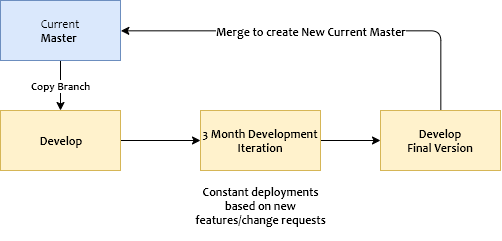

### 4.1.2. WebLDM Publishing Types based on Customers

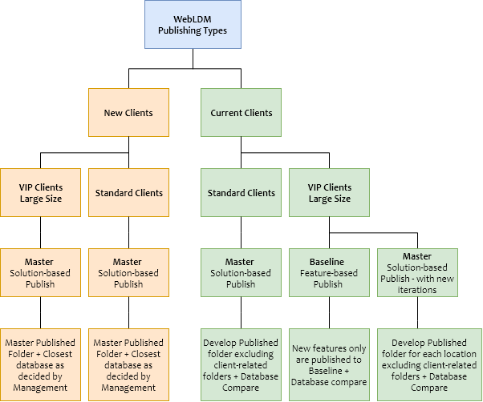

## 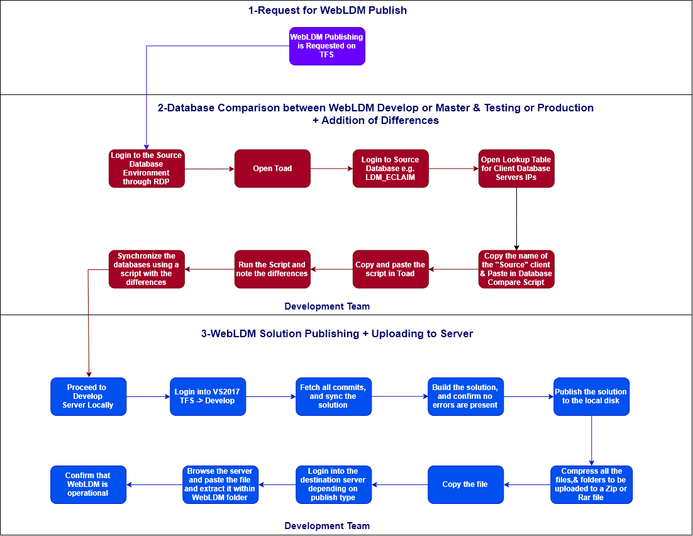4.3. General Publishing Workflow

As shown, when you publish WebLDM, generally the application and the database
are separate from one another, where the following occurs:

1.  WebLDM Publish is requested.

2.  The source’s (Develop or Master) database, schema, data, objects, etc. Are
    compared to the destination’s (Testing or Production) automatically or
    manually.

3.  A sync script is created based on the differences to insert them into the
    database.

4.  The application is built, and published to the local hard drive.

5.  The application’s published folders without customer-specific folders are
    uploaded to WebLDM on the destination server e.g. Testing/Production.

In the following section, we will proceed systematically based on the workflow.

# 5. Publishing Pre-Requisites

**TBD**

**  
**

# 6. Step by Step Publishing Procedures

In this section, you will proceed to publish WebLDM in this context:

**Source:** Develop Server  **Destination:** Testing Stage Server

**(Local Publish – Similar to Feature Development Workflow in GIT)**

## 6.1. WebLDM Publishing Request on TFS (Role: Software Testers)

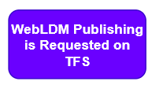

-   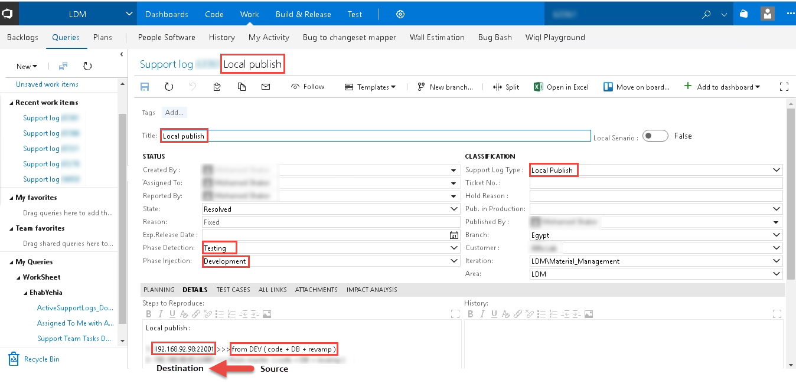The testing team requests
    from you a local/production WebLDM publish through a support log on TFS.

-   Take note of the customer and the target IP address.

## 6.2. Database Comparison (Role: Developers)

### 6.2.1. Opening the Database Environment

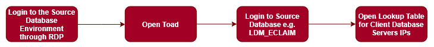

1.  Press **Start**, then search for “Remote Desktop Connection”, and click its
    icon to open it.

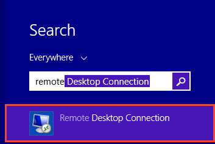

This window appears

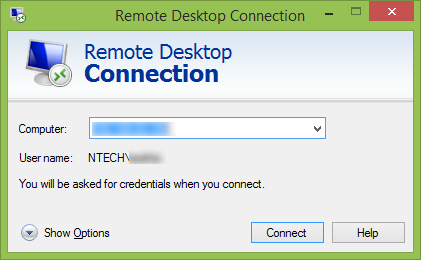

1.  Enter the IP address for the source database environment – using the table
    below, the IP in this case is
    [**http://192.168.80.14:22001**](http://192.168.80.14:22001) - and enter
    your credentials to login.

| Publish Instructions                                      | DB Compare        |                 |                  |                   |                  |                   |
|-----------------------------------------------------------|-------------------|-----------------|------------------|-------------------|------------------|-------------------|
| Environment                                               | **Name**          | **Branch name** | **From**         | **SERVER_IP**     | **To**           | **SERVER_IP**     |
| <http://192.168.80.14:22001>                              | **Testing Stage** | **Develop**     | **LDM_ECLAIM**   | **192.168.92.69** | **LDM_TEST**     | **192.168.92.69** |
| <http://192.168.92.98:22001>                              | **Main Testing**  | **Develop**     | **LDM_ECLAIM**   | **192.168.92.69** | **LDM_TEST**     | **192.168.92.69** |
| <http://192.168.80.43:22001>                              | **Bigdata**       | **Master**      | **LDM_BASELINE** | **192.168.92.68** | **LDM_ALFA**     | **192.168.80.20** |
| [http://192.168.92.98:22069](http://192.168.92.98:22069/) | **AlBaraka**      | **Master**      | **LDM_BASELINE** | **192.168.92.68** | **LDM_ALBARAKA** | **192.168.92.68** |
| [http://192.168.92.98:22068](http://192.168.92.98:22068/) | **Queen**         | **Master**      | **LDM_BASELINE** | **192.168.92.68** | **LDM_QUEEN**    | **192.168.92.68** |
| <http://192.168.92.98:22000>                              | **Cairo**         | **Master**      | **LDM_BASELINE** | **192.168.92.68** | **LDM_CAIRO**    | **192.168.92.68** |

1.  Open Toad App.

2.  Connect to the source database – **Develop database** – **LDM_ECLAIM** using
    the table above - The server IP in this case is **192.168.92.69**.

3.  Confirm the IP in Toad, and login using its user/schema **LDM_ECLAIM**, and
    its password.

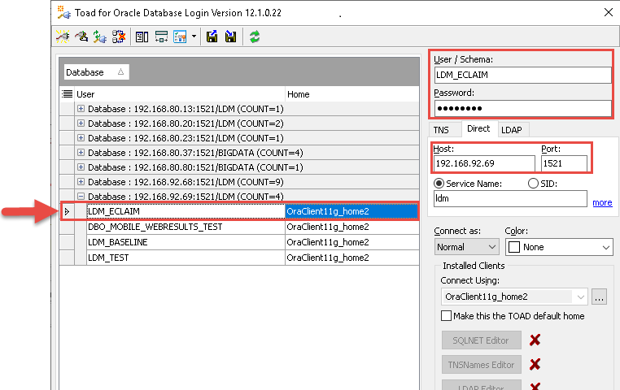

1.  Determine the customer’s name to enter it inside the DB comparison script.

2.  Confirm the customer’s name by doing the following:

3.  Open **Database -\> Schema Browser**.

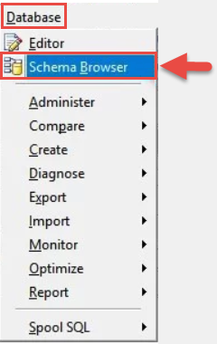

1.  In the “Filter” field, enter \*Creden\*, and press **Enter**.

    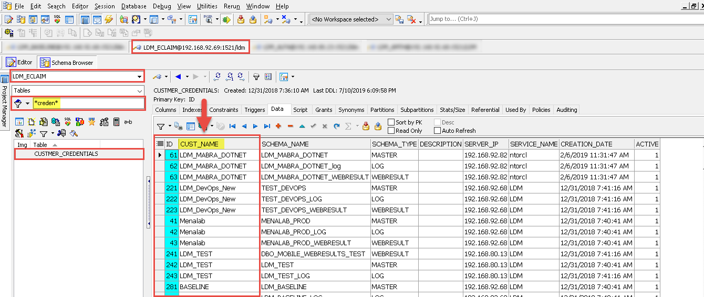The customers’ look up table
    appears

2.  Confirm the customer name =\> **LDM_MVC**.

### 6.2.2. Comparing & Synchronizing the Databases Automatically

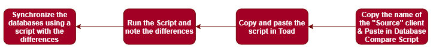

1.  Confirm that you are connected to the source database.

2.  Paste the customer’s name in “V_CUST_NAME” variable in the following script:

1.  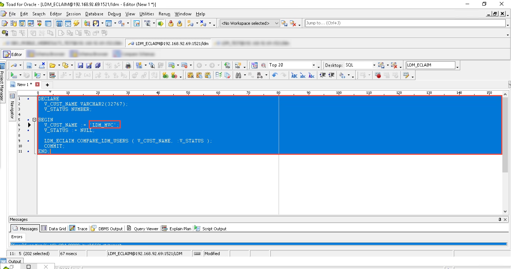Copy and paste the database
    comparison script inside the Editor.

2.  Press **Ctrl + A** to select all of the script, and press **F9**.

    All the differences between the two databases elements appear

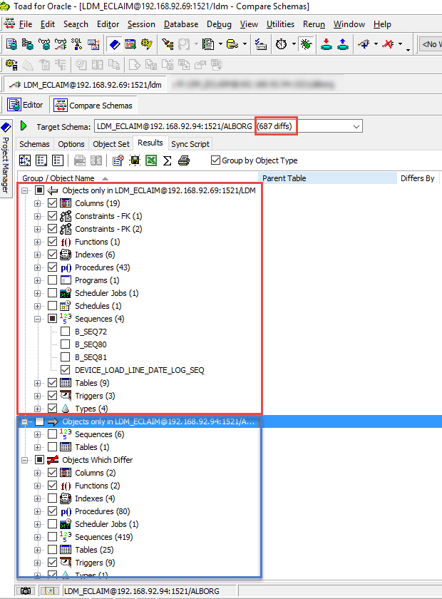

1.  Using “Sync Script” tab, Create a new script to add the differences to the
    database.

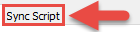

1.  Apply the script (TBD).

    All the differences are now added to the database.

## 6.3. Publishing WebLDM Application (Role: Developers)

### 6.3.1. Publishing WebLDM to a Local Folder

1.  Open Visual Studio 2017.

2.  Connect to TFS.

3.  Choose the **Develop** branch - The branch differs based on the client e.g.
    Master, Baseline, etc.

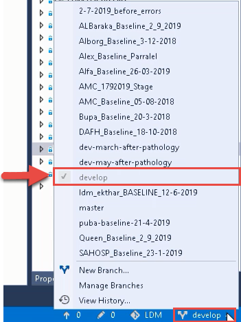

1.  Click **Fetch** to Fetch any incoming commits.

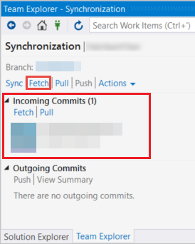

1.  Click **Sync** to pull any commits from the remote repo, followed by a push
    to the remote repo if no conflicts are present.

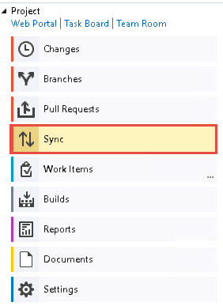

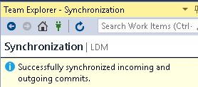

1.  Confirm that **LDMWebClient** project is the startup project.

2.  Right-click **LDMWebClient** project, and click **Build**.

3.  If any errors are present, resolve them.

    **Note:** In some cases, errors might occur and can be resolved by
    rebuilding specific projects within the solution (TBD exact projects).

4.  Right-click **LDMWebClient** project, and click **Publish**.

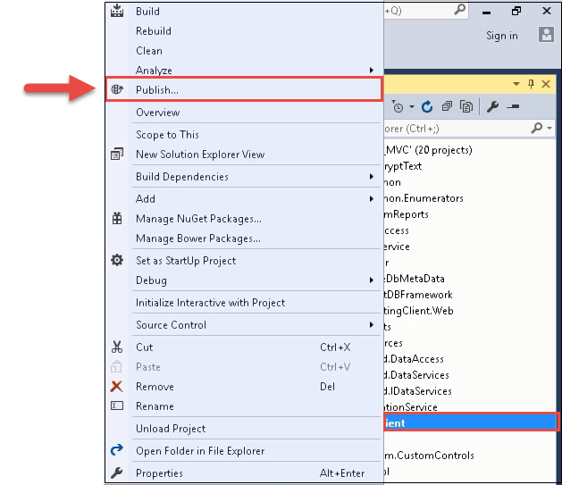

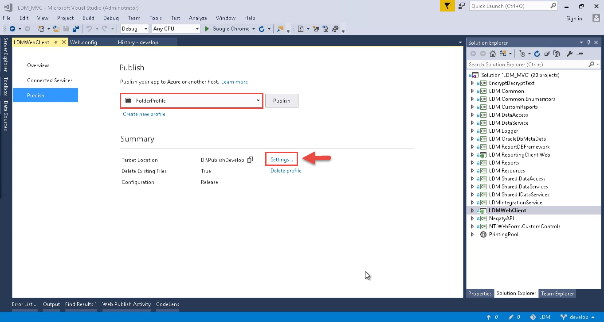The Publish page appears

1.  Choose “Folder Profile” as the publish profile.

2.  Click **Settings**.

    This window appears

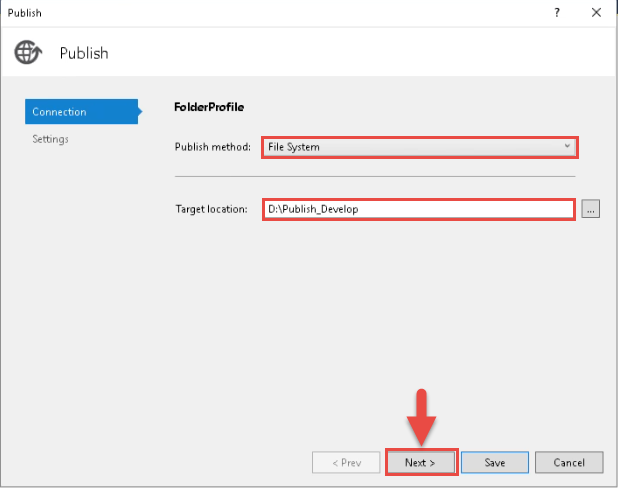

1.  Choose “File System”, and confirm the publish location on the hard drive,
    and then click **Next**.

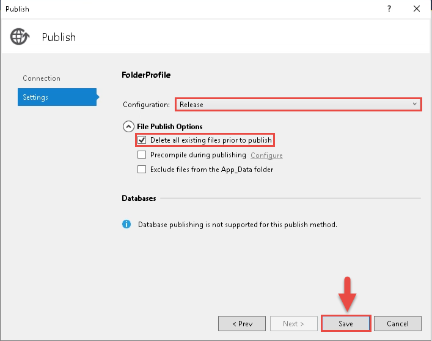

1.  Choose the following settings:

2.  From **Configuration** drop-down-list, choose “Release”.

3.  Click **File Publish Options**, and make sure that “Delete all existing
    files prior to publish” checkbox is marked.

4.  Click **Save**.

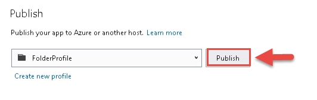

1.  Click **Publish**.

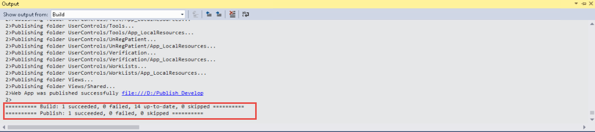

### 6.3.2. Uploading the Published Folder to the Site

To upload the published folder, do the following:

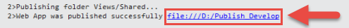

1.  Open the published folder by clicking this link:

    The folder appears

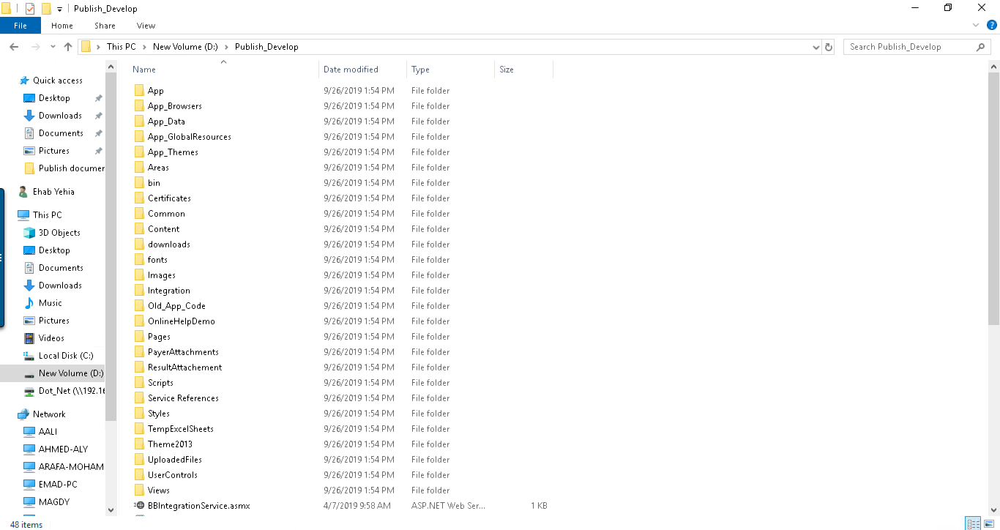

1.  Press **Ctrl + A** to select all files.

2.  Exclude the following folders:

    1.  Downloads

    2.  Images

    3.  Attachments

    4.  Upload files

    5.  Web.config

    6.  Payer Attachments

    7.  Results Attachments

**Notes:**

-   Copying all the files and not only the **Bin** folder is important, because
    sometimes there are important changes that are present within the
    application files.

-   Excluding these specific folders is a **critical step** to avoid overwriting
    the customer’s files, which includes important front-end files such as the
    logos.

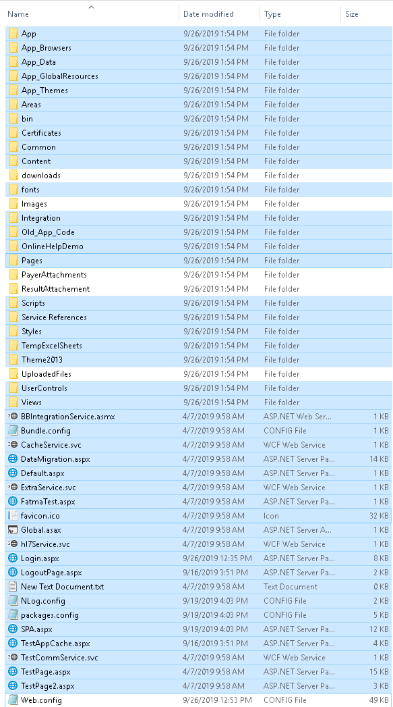

1.  Right-click the files, and compress them into an archive. E.g. RAR or ZIP.

2.  Copy the compressed file.

3.  Open **Remote Desktop Connection**, and enter the IP Address for the target
    server - Testing stage based on the support log – and enter your
    credentials.

    

4.  Open the **IIS Server**.

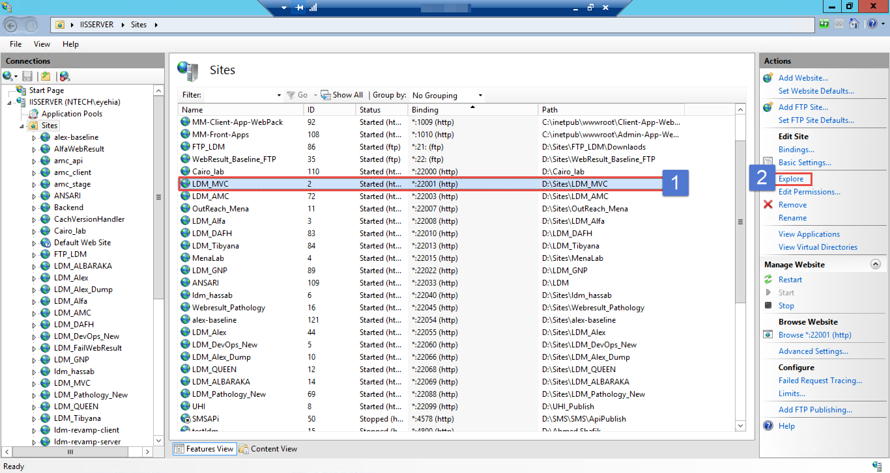

1.  Choose the site on which you will publish WebLDM – **LDM_MVC** in this case.

2.  Click **Explore** from the right column, to open the site’s folder.

3.  Paste the compressed file into the folder.

4.  Delete all the folders & files within that you copied within the compressed
    file.

5.  Extract the compressed file into the folder.

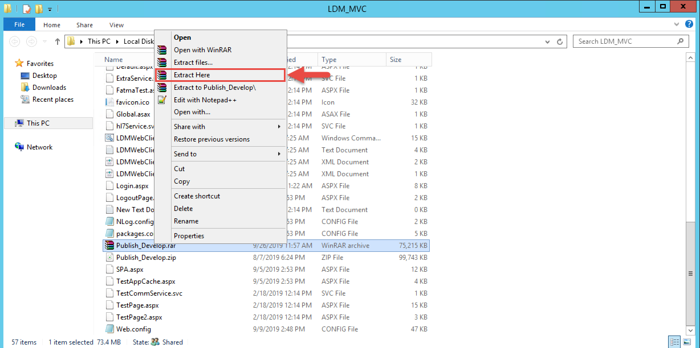

### 6.3.3. Confirming that WebLDM is Operational

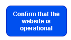

Before opening WebLDM to confirm it is operational, and to avoid creating
conflicts/issues, do the following:

Build

1.  Open the **Bin** folder within the published site.

2.  Confirm that the Shared Kernel DLL files have the latest version by doing
    the following:

    1.  Confirm that all the files are present - Shared Kernel DLL files are 19
        as shown.

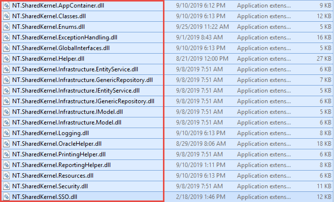

1.  Check their current version and their last modified date.

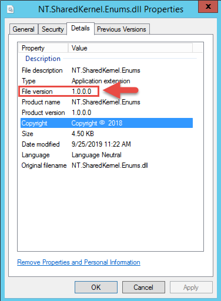

1.  Open this folder “D:\\NTECH_Libraries_May\\LDMLibraries” - which contains
    the latest version - and confirm that they have the same version.

    1.  If the version is lower, **copy only the same files** with the latest
        version from the folder and paste them in the published site folder.

    2.  Confirm the this key is added to Web.config:

        **(\<add key="Libraries" value="D:\\NTECH_Libraries_May\\LDMLibraries"
        /\>)**

        **Note:** If **any further issues** occur related to the **Shared
        Kernel**, **you can build the Shared Kernel solution**, yet it is
        unnecessary to build it on every publish.

2.  Confirm that the Pathology DLL files are the latest version by doing the
    following:

    1.  Confirm that all the files are present - Pathology DLL files are eight
        as shown.

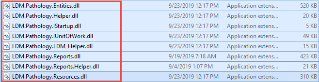

1.  Check their current version, and their last modified date.

    1.  Open a remote connection to
        “[192.168.80.9\\Dot_Net\\LDMLibraries\\LdmPathology](file:///\\192.168.80.9\Dot_Net\LDMLibraries\LdmPathology)”
        \- which contains the latest version - and confirm that they have the
        same version.

    2.  If the published version is lower, **copy only the same files** that has
        the latest version and paste them in the published site folder.

2.  Confirm the presence of the following keys within **Web.Config**:

    1.  **NT.WebForm.CustomControls**

        **(\<add tagPrefix="cdl" namespace="NT.WebForm.CustomControls"
        assembly="NT.WebForm.CustomControls" /\>)**

    2.  **RevampReports**

        **(\<add key="RevampReports" value="False" /\>) –** Value here is based
        on customer’s name

        **Note:** This key is used for customers that use the Revamp reports –
        Value=True, while for other customers – Value=False.

    3.  **WebClientAPIURL**

        **\<add key="WebClientAPIURL" value="192.168.92.98:5003" /\>)**

    4.  **NtAppAssistURL**

3.  Search for those two keys: The first has a static IP, the second has the IP
    of the target server (TBD: Confirm IP):

    **(\<add key="NtAppAssistURL" value="localhost:40600/AppAssist"/\>) Static
    IP**

    **\<add key="NtAppAssitDownloadLink"
    value="192.168.92.98:5003/NTAppAssist/NT-App-Assist.exe"/\>) IP is dependent
    on the target server IP**

    1.  **Application URL:**

        **\<add key="ApplicationURL" value="192.168.80.43:8043" /\>**

    2.  **Internal Request URL:**

        **\<add key="InternalRequestUrl" value="http://192.168.80.43:8043" /\>**

    3.  **Web Client URL “Revamp”:**

        **\<add key="WebClientURL" value="192.168.80.43:8070/" /\>**

    4.  **Web Client API URL “Revamp”:**

        **\<add key="WebClientAPIURL" value="192.168.80.43:8090" /\>**

    5.  **Libraries:**

        **\<add key="Libraries" value="D:\\NTECH_Libraries\\LDMLibraries_Master"
        /\>**

    6.  **WebResultUrl “Webresult”:**

        **\<add key="WebResultUrl" value="http://192.168.92.98:71" /\>**

    7.  **Oracle.DataAccess:**

        **\<bindingRedirect oldVersion="0.0.0.0-2.112.3.0"
        newVersion="4.112.3.0" /\>**

    8.  **Default Session Timeout:**

        **\<add key="DefaultSessionTimout" value="60"/\>**

1.  Search for these keys within “Config” in Angular Frontend:

    1.  **API URL:**

        **"apiUrl": "http://192.168.80.43:8090/",**

    2.  **LDM Domain**

        **"ldm_domain": "192.168.80.43:",**

    3.  **LDM Port:**

        **"ldm_port": "8043"**

2.  Search for these keys within “Config” in API Backend:

    1.  **ConnectionString:**

        **\<add name="ConnectionString" connectionString="DATA
        SOURCE=192.168.92.68:1521/ldm;PERSIST SECURITY INFO=True;USER
        ID=ldm_ansari;password=ldm_pass;Max Pool Size=700"
        providerName="Oracle.DataAccess.Client" /\>**

    2.  **Libraries**

        **\<add key="Libraries" value="D:\\NTECH_Libraries\\LDMLibraries_Master"
        /\>**

3.  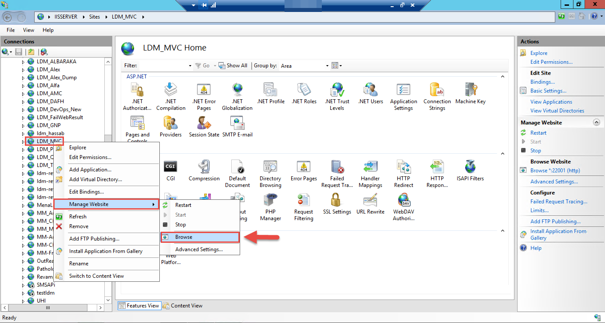Using **IIS Explorer**,
    choose the site and right-click it, choose **Manage Website**, and click
    **Browse**.

WebLDM site appears

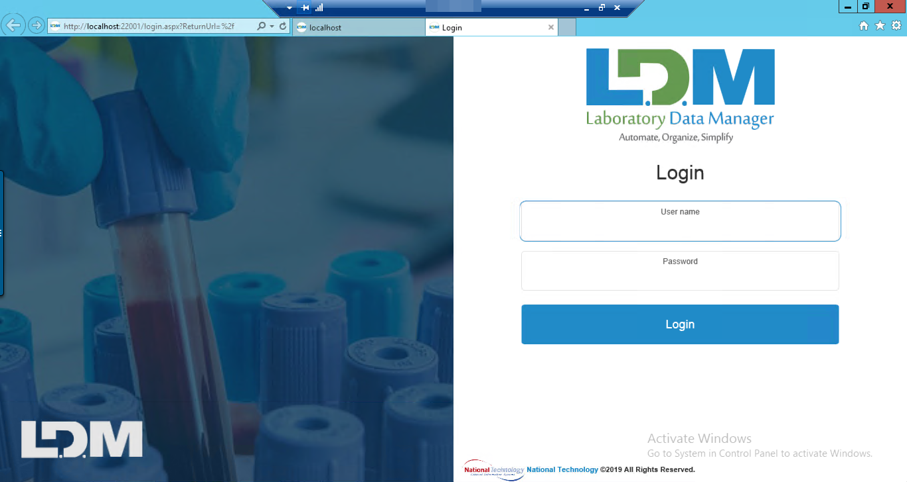

1.  Login into WebLDM, and confirm that there are no issues present.

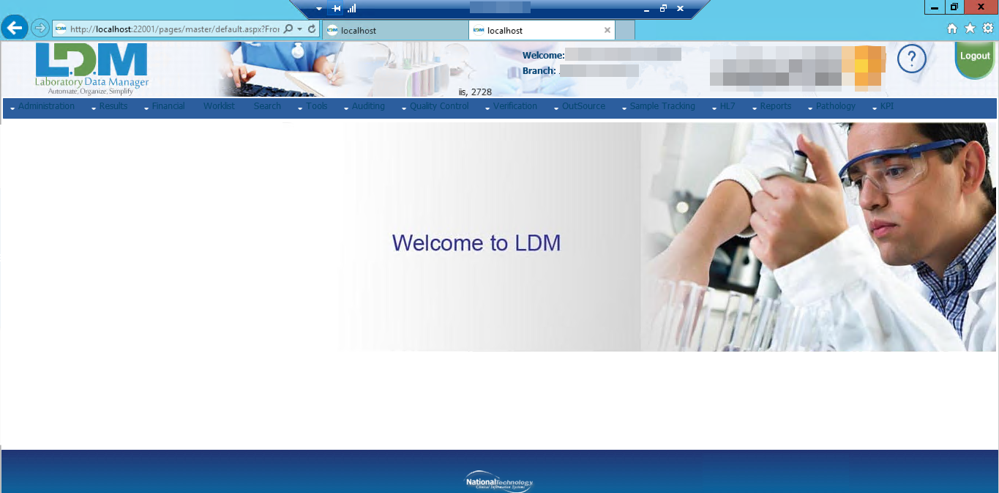

WebLDM is successfully published

**This concludes the WebLDM Publishing Manual for Developers.**

**  
**

# 7. Appendices

## 7.1. Appendix 1 – Git Branching Workflows

This section helps you to understand how GIT works in the context of WebLDM
publishing.

### 7.1.1 Git Data Transport Commands

#### 7.1.2. Definitions of GIT commands within Visual Studio Team Explorer

-   **Fetch:** performs a **Git Fetch**, which retrieves any commits from your
    remote repository without merging them.

-   **Pull:** performs a **Git Pull** which is a **Git Fetch** followed by a
    **Git Merge**.

-   **Push:** performs a **Git Push**, which is used to upload local repository
    content to a remote repository.

-   **Sync:** performs a **Git Pull** followed by a **Git Push**.

### 7.1.2 Main GIT Branches

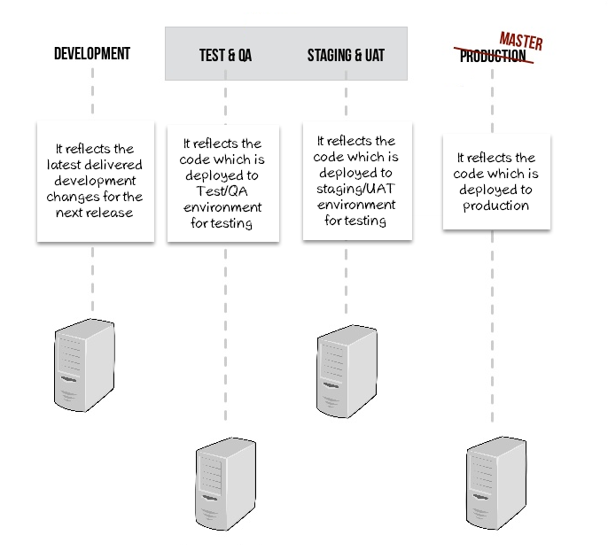

### 7.1.3. Feature Development in GIT

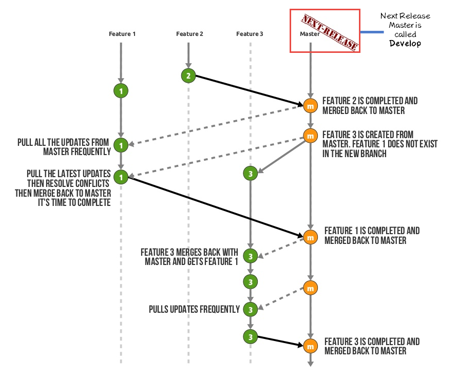

### 7.1.4. Release/Publish Management

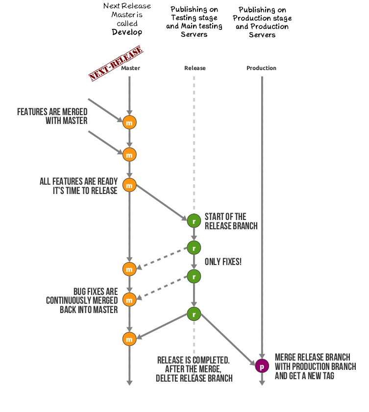

### 7.1.5. Baseline Hotfixes

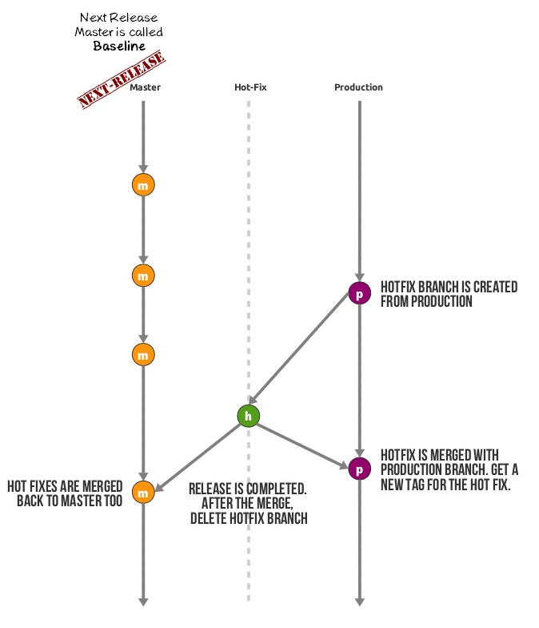

Reference (Adapted to our context):
<https://www.slideshare.net/lemiorhan/git-branching-model/>
